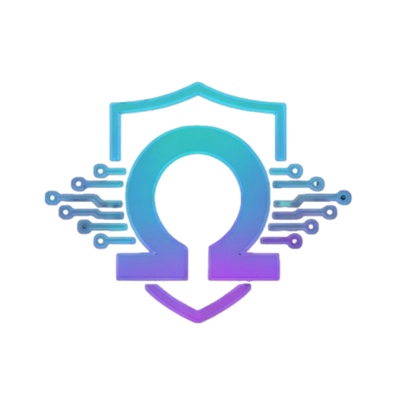
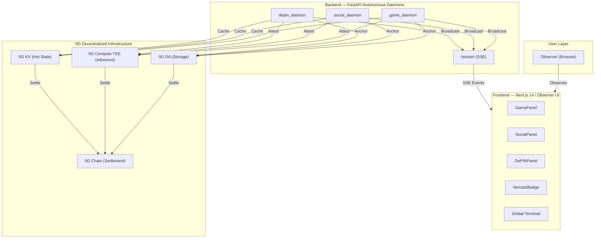
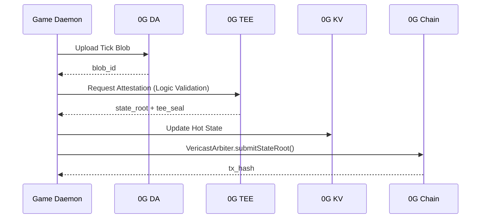
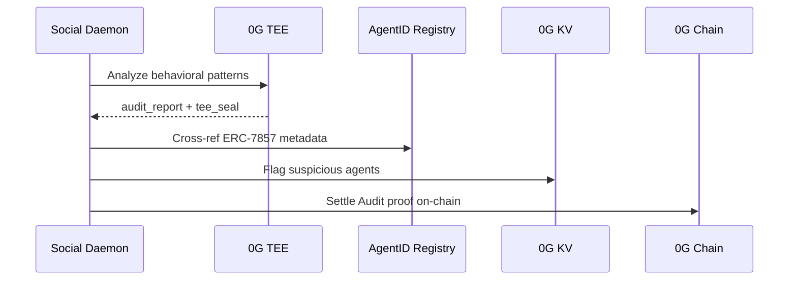
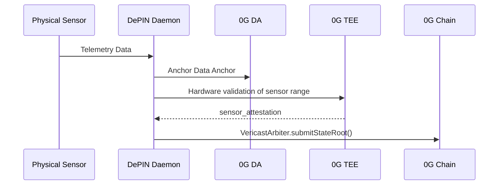
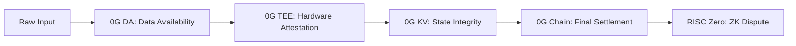

<div align="center">
  
  <h1>VERICAST OMEGA</h1>
  <p><strong>Unified Verifiable State Layer on 0G Network</strong></p>
  <p><em>Gaming · SocialFi · DePIN — Powered by TEE Attestation, DA Blobs, and On-Chain Settlement</em></p>

  <p>
    
    
    
    
  </p>

  <p>
    <a href="https://chainscan-galileo.0g.ai/address/0x67B2099e5B971129E85130F7dbe18929beC5E4D2">🔗 VERI Token</a> ·
    <a href="https://chainscan-galileo.0g.ai/address/0xF495bc8e6dDeCE3c76eDa91babe88041423d0181">⚖️ VericastArbiter</a> ·
    <a href="https://chainscan-galileo.0g.ai/address/0x12C0da1f898a50A18CeC5aCB83f27c1CcB071aEA">🪪 VericastAgentID</a>
  </p>
</div>

---

## 🔍 The Problem

Modern Web3 applications across **gaming**, **social finance**, and **decentralized physical infrastructure (DePIN)** share a critical, unresolved vulnerability: **state fraud**.

| Domain | The Problem |
|--------|-------------|
| 🎮 **Gaming** | Game servers can lie. Cheating tools manipulate client-side state. Match outcomes and in-game economies are unverifiable by players or third parties. |
| 🌐 **SocialFi** | Bot networks and Sybil accounts pollute decentralized social feeds. Reputation systems can be gamed without on-chain identity verification. |
| 📡 **DePIN** | Physical sensors transmit real-world data (temperature, humidity, location). There is no cryptographic guarantee that this data is authentic before it reaches a smart contract. |

**The root cause:** There is no neutral, hardware-enforced layer that can sit between real-world events and blockchain state — one that guarantees data integrity before it becomes immutable.

---

## 💡 The Solution: Vericast Omega

Vericast Omega is a **verifiable state layer** that connects real-world events to on-chain settlements through a tamper-proof pipeline, using the full 0G infrastructure stack.

> **Every state transition is: Ingested → Anchored → Attested → Settled.**

No off-chain logic is trusted blindly. Every computation is executed inside a **Trusted Execution Environment (TEE)**, its result is sealed with a hardware attestation, and then committed to **0G Chain** for permanent, auditable finality.

---

## 🌐 Web 4.0: The Observer Paradigm

Vericast Omega moves beyond the interactive models of Web2 and Web3 into the **Autonomous Observer Paradigm** of Web4. 

*   **Zero Human Intervention:** Logic is executed by autonomous daemons, not triggered by user buttons.
*   **Hardware-Attested Truth:** Computation happens in TEE enclaves (gpt-oss-120b), ensuring the backend cannot lie.
*   **Observer Role:** The user does not "play" or "input"; they *observe* a verifiable stream of cryptographic truth settled on the 0G Chain.

---

## 🏗️ System Architecture

### High-Level Topology



### The 5-Layer Architecture Stack

| Layer | Component | Role | Status |
|-------|-----------|------|--------|
| **L1 — Ingest** | 0G DA | Content-addressed blob storage. All raw inputs anchored before processing. | ✅ CONFIRMED |
| **L2 — Attest** | 0G Compute TEE | Hardware-sealed computation. Logic executes inside a secure enclave. | ✅ CONFIRMED |
| **L3 — Query** | 0G KV | Sub-second hot state for real-time dashboard sync and dApp queries. | ✅ CONFIRMED |
| **L4 — Settle** | 0G Chain | `VericastArbiter` commits the TEE-sealed state root. | ✅ CONFIRMED |
| **L5 — Identity** | VericastAgentID | ERC-7857 Intelligent NFT. Ties actors to verifiable operations. | ✅ CONFIRMED |

---

## 🔄 Operational Pipelines

### 1. Gaming: Tick-to-State


### 2. SocialFi: Sybil Audit


### 3. DePIN: Sensor-to-Chain



---

## 🔐 Smart Contracts

All contracts are deployed on **0G Galileo Testnet (Chain ID: 16602)**.

### `VericastArbiter.sol` — Optimistic Settlement Engine
- **Address:** [`0xF495bc8e6dDeCE3c76eDa91babe88041423d0181`](https://chainscan-galileo.0g.ai/address/0xF495bc8e6dDeCE3c76eDa91babe88041423d0181)
- Accepts TEE-sealed state roots via `submitStateRoot()`
- 150-block dispute window (`DISPUTE_WINDOW = 150`)
- Disputes resolved via RISC Zero ZK-proof (`resolveDispute()`)
- Supports batch submissions (`batchSubmit()`)
- UUPS upgradeable proxy pattern (OpenZeppelin)

### `VericastAgentID.sol` — ERC-7857 Agent Identity
- **Address:** [`0x12C0da1f898a50A18CeC5aCB83f27c1CcB071aEA`](https://chainscan-galileo.0g.ai/address/0x12C0da1f898a50A18CeC5aCB83f27c1CcB071aEA)
- NFT-based identity for agents (human or AI autonomous)
- Sybil resistance for SocialFi and DePIN contexts

### `VERI.sol` — Utility Token
- **Address:** [`0x67B2099e5B971129E85130F7dbe18929beC5E4D2`](https://chainscan-galileo.0g.ai/address/0x67B2099e5B971129E85130F7dbe18929beC5E4D2)
- ERC-20 utility token used for dispute staking (`MIN_STAKE = 1 VERI`)

---

## 🚀 Quick Start

### Prerequisites

- Node.js v20+, npm
- Python 3.11+
- An EVM wallet with 0G Galileo testnet tokens

### 1. Frontend

```bash
cd frontend
npm install
cp .env.example .env.local  # Configure your API URL
npm run dev
```

**Environment Variables (`frontend/.env.local`):**
```env
NEXT_PUBLIC_API_URL=http://127.0.0.1:8000
NEXT_PUBLIC_EXPLORER_URL=https://chainscan-galileo.0g.ai
```

Open [http://localhost:3000](http://localhost:3000)

### 2. Backend

```bash
cd backend
pip install -r requirements.txt
cp .env.example .env  # Configure 0G credentials
uvicorn main:app --host 0.0.0.0 --port 8000
```

**Environment Variables (`backend/.env`):**
```env
PRIVATE_KEY=your_wallet_private_key
OG_RPC_URL=https://evmrpc-testnet.0g.ai
OG_CHAIN_ID=16602
OG_DA_RPC=https://rpc-storage-testnet.0g.ai
OG_KV_RPC=https://rpc-kv-testnet.0g.ai
OG_TEE_BROKER_URL=https://broker.tee.0g.ai
VERICAST_ARBITER=0xF495bc8e6dDeCE3c76eDa91babe88041423d0181
```

### 3. Verify the Backend is Running

```bash
curl http://127.0.0.1:8000/health
```

Expected response:
```json
{
  "status": "healthy",
  "0g_da": true,
  "0g_kv": true,
  "0g_tee": true,
  "0g_chain": true,
  "integrations_verified": true
}
```

### 4. Docker Compose (Optional)

```bash
docker-compose up --build
```

---

## 🌐 Live API Endpoints

| Method | Endpoint | Description |
|--------|----------|-------------|
| `GET` | `/health` | System health — all 0G services status |
| `GET` | `/stream` | SSE real-time event stream (dashboard sync) |
| `POST` | `/game/submit-tick` | Submit and verify a game tick |
| `POST` | `/social/audit` | Trigger Sybil audit on a social feed |
| `GET` | `/depin/weather/{lat}/{lon}` | Ingest and verify sensor telemetry |

---

## 🛠️ Tech Stack

| Layer | Technology |
|-------|-----------|
| **Frontend** | Next.js 14, TypeScript, Tailwind CSS, Framer Motion |
| **Backend** | Python 3.11, FastAPI, uvicorn, 0G TypeScript SDK |
| **Smart Contracts** | Solidity 0.8.24, Hardhat, Foundry, OpenZeppelin |
| **0G Infrastructure** | 0G DA, 0G Compute (TEE), 0G KV, 0G Chain EVM |
| **Security** | Trusted Execution Environment (TEE), RISC Zero ZK (dispute), UUPS Proxy |

---

## 🔐 Security Model

Vericast Omega implements a **Defense-in-Depth** cryptographic pipeline:



**Key Invariants:**
- **Anti-Withholding:** All inputs anchored in 0G DA before processing.
- **Hardware Enforced:** TEE (gpt-oss-120b) ensures logic cannot be tampered with by the operator.
- **Sub-Second Proofs:** 0G KV ensures hot state is verifiable within milliseconds.
- **ZK Arbitration:** Disputes on-chain are resolved via trustless RISC Zero zero-knowledge proofs.
- **Unified ID:** Agent identities are bound to ERC-7857 NFTs on 0G Chain.

---

## 📄 License

MIT License. See [LICENSE](../LICENSE) for details.

---

<div align="center">
  <p>Built for <strong>HackQuest × 0G Galileo Testnet Hackathon 2026</strong></p>
  <p>
    <a href="https://chainscan-galileo.0g.ai/address/0xF495bc8e6dDeCE3c76eDa91babe88041423d0181">⚖️ VericastArbiter on Explorer</a> ·
    <a href="https://chainscan-galileo.0g.ai/address/0x12C0da1f898a50A18CeC5aCB83f27c1CcB071aEA">🪪 AgentID on Explorer</a> ·
    <a href="https://chainscan-galileo.0g.ai/address/0x67B2099e5B971129E85130F7dbe18929beC5E4D2">🪙 VERI Token on Explorer</a>
  </p>
</div>
